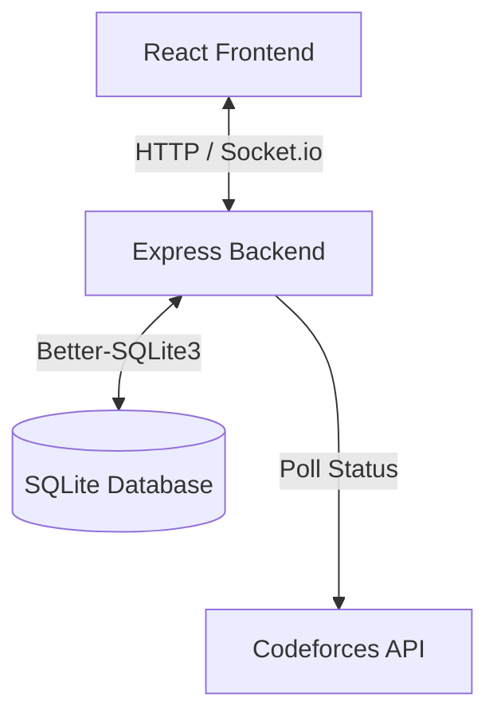

# CodeArena Technical Documentation

CodeArena is a real-time competitive programming platform designed for hosting coding duels, team battles, and multi-player battle royales. It integrates with the Codeforces API to dynamically fetch problems, track submissions, and verify user solves in real-time.

---

## 🏗️ System Architecture

CodeArena is built as a unified TypeScript application combining a React frontend and an Express + WebSocket backend, powered by a SQLite database.



### 1. Frontend Stack
- **Framework:** React 19 (Single Page Application)
- **Bundler:** Vite 6
- **Routing:** React Router 8
- **Styling:** Tailwind CSS v4 (with `@tailwindcss/vite` plugin)
- **Animations:** Framer Motion (v12)
- **Data Visualization:** Recharts (v3)
- **Icons:** Lucide React

### 2. Backend Stack
- **Runtime:** Node.js (executed via `tsx` in development)
- **Server Framework:** Express (v4)
- **Real-time Protocol:** Socket.io (v4) for bi-directional event broadcasting
- **HTTP Client:** Fetch API (with `node-fetch` wrapper)
- **Authentication:** 
  - JWT (`jsonwebtoken` v9) + Password Hashing (`bcryptjs` v3)
  - OAuth2 integration with Google (`google-auth-library`) & GitHub

### 3. Database Layer
- **Engine:** SQLite (persistent local storage at `./codearena.sqlite`)
- **Driver:** `better-sqlite3` (v12), providing synchronous database executions for speed and simplicity.

---

## 🎮 Game Modes & Scoring Logic

The platform supports three distinct game modes, each with its own real-time polling logic and rulesets:

### 1. Bingo (Classic Match)
- **Format:** Players form two teams competing on a grid of coding problems (e.g., 5x5).
- **Verification:** The backend pollers fetch submissions for active players. If a player submits a correct solution (verdict `OK`) after the match start time, a solve is recorded.
- **Victory Condition:** Checked via `winChecker.ts`. The first team to complete a full line (horizontal, vertical, or diagonal) wins the match.
- **Prize Payout:** Wagers are aggregated into a prize pool, which is distributed to the winning team's members upon match completion.

### 2. Clash Squad
- **Format:** Round-based team battles using 5 question slots of increasing difficulty.
- **Problem Distribution:** Slots are populated dynamically using Codeforces problems within rating ranges:
  - Slot 1: Rating 800 - 1000 (Base: 500 pts)
  - Slot 2: Rating 1000 - 1200 (Base: 1000 pts)
  - Slot 3: Rating 1200 - 1400 (Base: 1500 pts)
  - Slot 4: Rating 1400 - 1600 (Base: 2000 pts)
  - Slot 5: Rating 1600 - 1900 (Base: 2500 pts)
- **Scoring Algorithm:**
  - Base points are modified dynamically by the solver's rank (first team to solve gets the highest points, subsequent solvers get decay/reduced points).
  - **Sweep Bonus:** If a single team solves all questions in a specific slot, they receive bonus points.
- **MVP Selection:** Determined at the end of the match based on individual score contributions.

### 3. Battle Royale
- **Format:** Multi-player elimination mode (5 to 20 players).
- **Structure:** Players advance through rounds of increasing difficulty.
  - Round 1: Rating 800 - 1000
  - Round 2: Rating 1000 - 1200
  - Round 3: Rating 1200 - 1500
  - Round 4: Rating 1500 - 1800
  - Round 5: Rating 1800 - 2200
- **Elimination Mechanics:**
  - Players must solve the current round's problem to stay alive.
  - The slowest solver or anyone who fails to solve within the round duration is eliminated.
  - The last surviving player wins the entire prize pool.

---

## 🔄 Real-Time Polling & Orchestration

To prevent rate-limiting and IP blocks from the Codeforces API, CodeArena utilizes an active backend polling system:

- **Orchestrator:** `pollerOrchestrator.ts` triggers background polling loops:
  - **Bingo Poller:** Runs at customizable intervals. It loops through active matches and fetches status updates.
  - **Clash Squad Poller:** Runs every 11 seconds.
  - **Battle Royale Poller:** Runs every 12 seconds.
- **Rate-Limiting Safeguard:** Implements a strict `1.1-second` delay between individual user API fetches to abide by Codeforces' rate limits.
- **Caching:** Employs an in-memory submission cache per user handle to avoid duplicate API calls during high-frequency checks.

---

## 🗃️ Database Schema

The SQLite schema initializes the following key tables in [db.ts](file:///c:/Users/letha/OneDrive/Desktop/codearena/src/backend/db.ts):

| Table Name | Primary Keys & References | Purpose |
| :--- | :--- | :--- |
| `users` | `id` (PK) | Stores user profiles, credentials, OAuth providers, and coin balances. |
| `matches` | `id` (PK), `winner_team_id` | Metadata for Bingo matches (grid size, wagers, prize pool). |
| `teams` | `id` (PK), `match_id` (FK) | Team grouping for Classic/Bingo matches. |
| `team_members` | `id` (PK), `team_id` (FK), `user_id` (FK) | Links users to teams, tracking their registration status. |
| `solves` | `id` (PK), `match_id` (FK), `team_id` (FK) | Records verified Codeforces submissions mapped to match grids. |
| `coin_transactions`| `id` (PK), `user_id` (FK) | Audit log for coin wagers, winnings, and refunds. |
| `cs_matches` / `cs_teams` | `id` (PK) | Metadata and team states for Clash Squad matches. |
| `cs_solves` | `id` (PK), `match_id` (FK) | Clash Squad problem solves and points earned per user. |
| `br_matches` / `br_players` | `id` (PK) | Game state and life status (`alive` / `eliminated`) for Battle Royale. |
| `br_solves` / `br_eliminations` | `id` (PK) | Track solves, solve speeds, and round eliminations. |

---

## ⚙️ Environment Variables

Copy `.env.example` to `.env.local` and define the following properties:

```ini
# Gemini API Configuration
GEMINI_API_KEY="your_api_key_here"

# OAuth Credentials
GITHUB_CLIENT_ID="your_github_client_id"
GITHUB_CLIENT_SECRET="your_github_client_secret"
GOOGLE_CLIENT_ID="your_google_client_id"
GOOGLE_CLIENT_SECRET="your_google_client_secret"

# JWT Secret
JWT_SECRET="your_jwt_secret"
```

---

## 🛠️ Scripts & Operations

Manage the application using the following NPM scripts:

- **Development Server:** Runs the backend API, WebSocket gateway, and SPA Vite server.
  ```bash
  npm run dev
  ```
- **Linter & Type Checking:** Verifies TS compiler directives.
  ```bash
  npm run lint
  ```
- **Production Build:** Transpiles frontend files via Vite and bundles the server using `esbuild`.
  ```bash
  npm run build
  ```
- **Production Run:** Launches the production output package.
  ```bash
  npm run start
  ```
